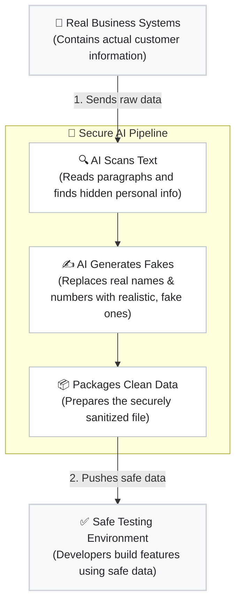

# veriLLM: AI-Powered DevSecOps Pipeline

**veriLLM** is an AI-powered pipeline designed to sanitize sensitive data (PII) before it moves from secure Production environments to lower-security Developer Sandboxes. It replaces rigid regex rules with a local LLM to understand context and swap real PII with safe, synthetic data.

## 🌟 The Problem
*   Developers need realistic data to build features and test code in Sandboxes.
*   Copying real Production data exposes sensitive customer information (SSNs, Emails, Phones).
*   Traditional Regex fails on unstructured text (like support chat transcripts or case descriptions).

## 🚀 The Solution
*   **Context-Aware AI:** Uses a local LLM (Llama 3) to analyze unstructured text, identify PII, and generate realistic fake replacements.
*   **Zero Data Leakage:** All processing happens **In-Memory** via ephemeral Docker containers (tmpfs). No sensitive target data is ever written to a physical disk.
*   **Microsegmentation:** The AI engine operates on an isolated network without internet access.

## 🏗️ Architecture & Flowchart

The following flowchart illustrates how target data moves from the Production environment, through our secure AI engine, and safely into the Developer Sandbox.

## 🛠️ Tech Stack
*   **Python:** Orchestrates the data flow and connects to APIs.
*   **Ollama (Llama 3):** Local Large Language Model for processing text contextually.
*   **Docker & Docker-Compose:** Containerizes the worker and LLM to enforce strict network isolation and temporary file storage (tmpfs).
*   **LangChain:** Framework for interacting with the LLM.

## ⚡ Execution
*   **Local Test:** Run `python scripts/mock_generator.py` to see the engine scrub PII from mock JSON payloads instantly.
*   **Secure Container:** Run `docker-compose up --build` to deploy the isolated pipeline.
